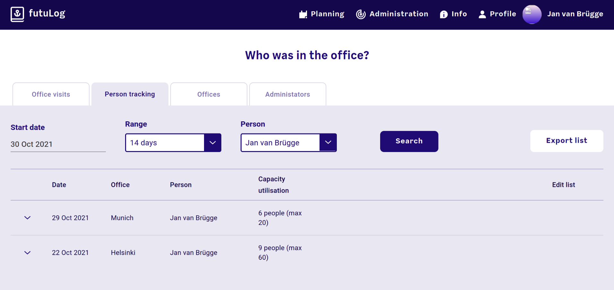
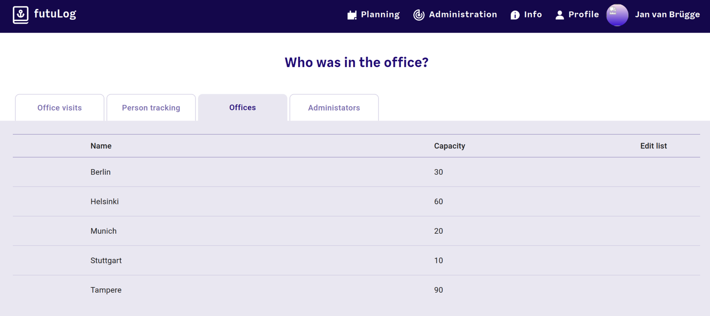
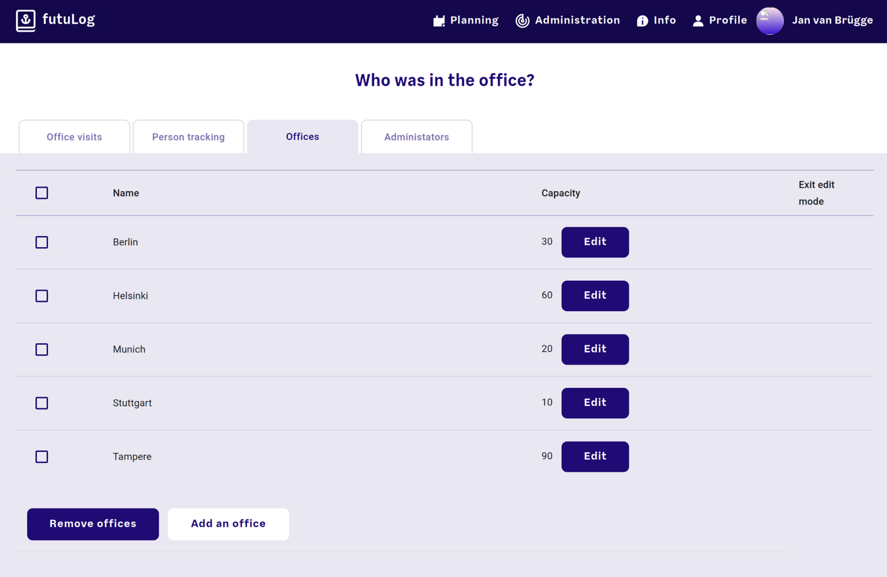

# Project report: futuLog

## Table of contents

<!-- toc -->

## Introduction

Due to the COVID-19 pandemic, in the first half of 2020, Futurice had all employees work from home. As the restrictions were partly lifted and some people needed material or equipment from the office, a system had to be put in place to trace contracts. The german government required that in case of a positive COVID-19 test, all other employees that were in contact with the positive individual need to be contacted in order to be tested themselves.

At first, this was accomplished with an Excel spreadsheet that everyone could write to. However, this approach quickly showed severe limitations. It was hard hard to use, especially on mobile devices, e.g. it was very easy to accidentaly delete other cells or be off by one column and sign in as another employee. As a result of that, only about 50% of the people that went to the office actually signed into the sheet. Additionally there were some privacy concerns. With the spreadsheet, all historical data was collected for everyone to see, so if anyone was aware that there had been a positive case at a certain date, they could just look up the date and guess who was the person in question.

These concrete problems formed the requirements for the development of an application to do the tracing:

- Easy to use, with first class mobile support
- Only a small group (administrators) can see past data for privacy
- Can export a list of all people that were in contact with a given person in the last two weeks (again only for administrators)

The application that was developed in turn was later called **futuLog**.

## The team

The team varied over time as client projects required designers and developers as staff. The biggest contributors to futuLog were:

- Beatrice Rachello (Design)
- Simon Messmer (Design)
- Alex Seidler (Frontend Development)
- Egor Sorokin (Frontend Development)
- Pierre Hedkvist (Frontend Development)
- Viktorija Valsoe (Frontend Development)
- Jan van Brügge (Me -- Backend Development, later some Frontend Development)

The office management and human care teams of Germany and later on also Finland were acting as the stakeholders, giving feedback and requirements for the project.

## Minimum Viable Product

### User interface

Most of the work was in the user interface. The design team started with user research and interviews in order to make futuLog as intuitive as possible. At the same time, the frontend team started setting up the development environment, decided to use [React](https://reactjs.org/) with [material-ui](https://mui.com/) as a component library for the project. As soon as the first few main pages had a complete design, the team implemented them in the codebase.

When a new user first opens futuLog, they are redirected to the welcome screen where they can select their usual office. This will be the office they sign in by default:


After clicking "start", or when visiting futuLog the next time, the user starts at the main view:


In this main view the user can immediately book a spot in their default office by clicking the big "Office" button. Once they do, they have the option to confirm their stay. This is meant to be done once you really are in the office and it will lock in that choice:


With either the "Planning" button in the top bar or the "Planning" button at the bottom, the user gets to the planning view which shows their choices for the next few days:


By clicking on one of the dates, the user can book a spot in advance. This booking view shows the user how many spots are still left in the office and who booked those spots. It also allows them to change the office they want to reserve a spot in:


### Administration

To make the development faster, the initial version that was deployed internally did not have an administration interface. However, the backend provided an API that could be used by a developer in case a positive case occured before this feature is ready.


### Backend

The backend of futuLog is written in [Haskell](https://www.haskell.org/). Haskell is a pure functional programming language with an excellent type system and very good support for concurrency. The public API uses the [servant](https://github.com/haskell-servant/servant) library which allows to specify the whole API as a type and get the routing, parsing and error handling for free. For example this snippet defines a complete echo API, that expects a JSON object with a message as POST request body to the `/echo` URL and returns that message as plain text back:

```haskell
import Aeson
import Data.Proxy
import Servant.API
import Network.Wai.Handler.Warp

data Message = MkMessage { msg :: String }
  deriving (Generic, FromJSON)

type EchoAPI = "echo" :> ReqBody '[JSON] Message :> Post '[PlainText] String

handler :: Server EchoAPI
handler messageObj = pure (msg messageObj)

main = run 8000 (serve (Proxy @EchoAPI) handler)
```

In case the user would send `{ "mssg": "Hello World" }` (note the typo in the key), servant would automatically return an appropriate error. Servant was chosen because of this. It allows the developer to focus on the application logic and not on the communication with the outside world.

To save all the registrations and to make the query for contacts easy, PostgreSQL was chosen as a database. It is a very mature, open source, easy to use, relational database that enable the developer to do complex queries with SQL. To use PostgreSQL from Haskell, the [postgresql-simple](https://hackage.haskell.org/package/postgresql-simple) library was chosen.

For the MVP, luckily we did not have to take care about authenticating users. The Futurice IT team provides the company with a platform called Playswarm, that allows easy deployment as a [Docker](https://www.docker.com/) container, can provide a PostgreSQL database that already has backups configured and most importantly provides a reverse proxy that takes care of authenticating users with the login.futurice.com service. The whole application architecture for the MVP looks like this:


## Further development

After the deployment of the MVP in June 2020, futuLog was improved. Most of the improvements that are visible to the outside were to enable us to Open Source the application. The goal was to make futuLog independent of Futurice-internal infrastructure and that none of the day to day usage should require hand-holding by a developer.

### Administration interface

Shortly after the initial release, we provided a user interface to see the list of people that were either in the office on a given day or the list of people that were in contact with a given person in a given timeframe. These two views are only accessible to administrators, which at that point had to be added to a config file. This meant that adding new administrators required a developer, but after that, most of the day to day work could be done without one. The first view looks like this:


The second view looks like this:



The data from both of these views can be exported to CSV, which in turn can be imported directly into Excel. So in case of a positive COVID-19 case, the administration team can download the data and easily contact all the people from the list.

### Okta migration

While the backend and the database are already available for anyone to self-host, the big issue was the authentication which was tied to the login.futurice.com infrastructure. In addition to our effords to Open Source futuLog, Futurice itself was moving from that login infrastructure to a new identity provider - Okta. While a migration of playswarm to use the new Okta service was planned, it did not have a concrete timeframe at the time. Okta, like many other identity providers, can authenticate users with multiple open protocols, one of with is **OpenID Connect** (OIDC). By implementing this in the backend, a user of the Open Source version could simply connect their own internal identity provider for futuLog. After learning how OIDC words and implementing it in the backend, the architecture now does not need the proxy any more and can be deployed anywhere where a docker container can run:


After implementing this feature, I presented my learnings internally in the company, the recording of which is available on YouTube now:

<iframe height="465" src="https://www.youtube-nocookie.com/embed/wk9v5upj_7I" title="YouTube video player" frameborder="0" allowfullscreen></iframe>

### Removing the need for developers

After adding the initial administration interface there were only two tasks that the administration team was not able to do by themselves. The first one was changing the maximum number of people that were allowed in the office at any given day, the second one was adding and removing other administratiors. Before Open Sourcing futuLog we wanted to fix these two issues. The result was two new tabs in the administration section where offices and administrators can be defined.

Office tab in read mode:


Office tab in edit mode:


The page to add and remove administrators works in just the same way as the office tab.

### Open Sourcing futuLog

At that point, futuLog was completely decoupled from the internal infrastructure, did not need any developers or operators beyond initial setup and it was easy to use and mature after over a year of continued usage inside Futurice. At this point we published [the project on GitHub](https://github.com/futurice/futuLog) under the permissive MIT license, and announced it with [a blog post](https://futurice.com/blog/open-sourcing-futulog).

## Impact

To properly assess the impact of futuLog, the collected raw data was processed and analysed. For this, this very report is a static HTML page that fetches that processed and anonymous data and uses client side JavaScript to visualize the data and make it interactive. In total, there were **$$numPeople$$** unique people that logged into one of the 5 offices at least once. Those people together have booked a slot in the office **$$numRegistrations$$** times on **$$numDays$$** different days.

### Pairings of people

The first analysis is how often individual pairs of people have met in the office. In the following visualization, the x-Axis shows how often a unique pair of two people have met in the office, the y-Axis shows how many such pairings exist (note the logarithmic scale). "Met" in this context means that they were at the same day in the same office. Looking at the graph we can see that **<span id="pairs_bars_max_y"></span> pairs** of two people have met **only once** in the office, while **<span id="pairs_bars_max_x_y_pairs"></span>** <span id="pairs_bars_have_plural">have</span> met **<span id="pairs_bars_max_x"></span>** times.

<style>
#pairs_bars_date {
  width: 100%;
}
.bar {
  fill: steelblue;
}
</style>

<div>
  <svg id="pairs_bars"></svg>
  <div class="line">
    <label for="pairs_bars_date">Date: <span id="pairs_bars_value"></span></label>
    <button id="pairs_bars_play">Play</button>
    <div class="office">
      <input id="pairs_bars_Munich" type="checkbox" checked></input>
      <label for="pairs_bars_Munich">Munich</label>
    </div>
    <div class="office">
      <input id="pairs_bars_Berlin" type="checkbox" checked></input>
      <label for="pairs_bars_Berlin">Berlin</label>
    </div>
    <div class="office">
      <input id="pairs_bars_Stuttgart" type="checkbox" checked></input>
      <label for="pairs_bars_Stuttgart">Stuttgart</label>
    </div>
    <div class="office">
      <input id="pairs_bars_Helsinki" type="checkbox" checked></input>
      <label for="pairs_bars_Helsinki">Helsinki</label>
    </div>
    <div class="office">
      <input id="pairs_bars_Tampere" type="checkbox" checked></input>
      <label for="pairs_bars_Tampere">Tampere</label>
    </div>
  </div>
  <input id="pairs_bars_date" type="range"></input>
</div>

With the control above it is also possible to see the data per office and over time. Use the slider to see the accumulated date up until the given date or use the "Play" button to see the data as an animation.

### Inter-office contacts

To see how the different office are interconnected or how seperate they are, a graph plot was chosen. Every red dot in the visualization is a person. A line between two persons means that those two persons have met at least once in the office. The color of the line says in which office the two have met the most:

- Blue: Helsinki
- Green: Tampere
- Red: Munich
- Gray: Berlin
- Violet: Stuttgart

<div>
  <em id="force_graph_text">Simulation running, please wait until the graph is properly layouted</em>
  <svg id="force_graph"></svg>
</div>

As the big Finnish offices distord the data a bit, here is the same data, but only with the three German offices:

<div>
  <em id="force_graph_germany_text">Waiting for first simulation to finish before starting</em>
  <svg id="force_graph_germany"></svg>
</div>

And for completeness, with only the Finnish offices:

<div>
  <em id="force_graph_finland_text">Waiting for first simulation to finish before starting</em>
  <svg id="force_graph_finland"></svg>
</div>
